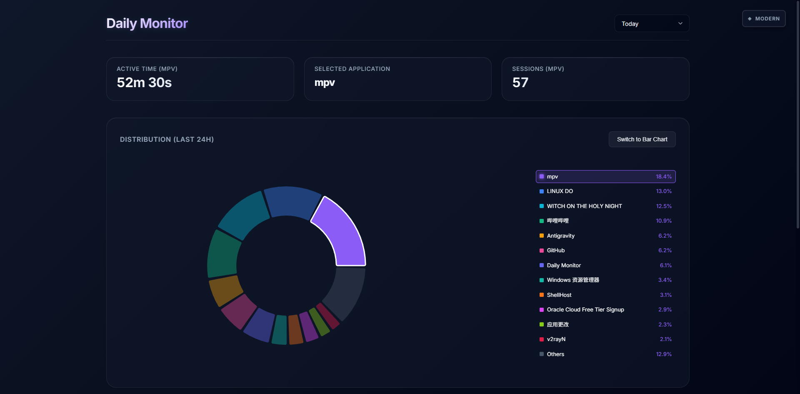
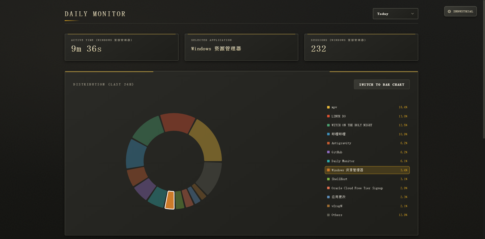
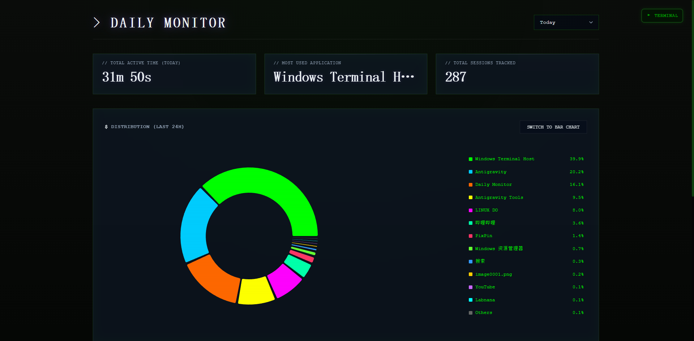

# Daily Monitor

[中文文档](./README_ZH.md)

An automated, local-first system to track your daily computer usage, visualizing active applications and website visits. Designed for Windows with minimal performance impact.

## Preview

| Modern | Industrial | Terminal |
|--------|------------|----------|
|  |  |  |

## Features

- **Real-time Tracking**: Monitor active applications and browser tabs every second
- **Smart Idle Detection**: Automatically pause tracking when away (keyboard/mouse/gamepad/media)
- **Multiple Themes**: Switch between Modern, Industrial, and Terminal themes
- **Auto Site Name Detection**: Automatically extract website names from page titles
- **Interactive Filtering**: Click charts to filter activity logs, search by app/title/URL
- **Date Range Selection**: View today, yesterday, last 7/30 days, or custom range
- **Local & Private**: All data stored locally in SQLite, no cloud sync

---

## Quick Start

### Prerequisites

- **Node.js**: v16 or higher
- **Windows OS**: Required (uses Windows native APIs)
- **.NET Framework**: Required for compiling C# tools

### Installation

```bash
# 1. Clone the repository
git clone https://github.com/lila233/daily_monitor.git
cd daily_monitor

# 2. Install server dependencies
npm install

# 3. Install client dependencies
npm install --prefix client

# 4. Compile native tools (required on first run)
cd server/tools
C:\Windows\Microsoft.NET\Framework64\v4.0.30319\csc.exe /out:IdleCheck.exe IdleCheck.cs
C:\Windows\Microsoft.NET\Framework64\v4.0.30319\csc.exe /out:GamepadCheck.exe GamepadCheck.cs
cd ../..

# 5. Build the client
npm run build --prefix client
```

### Running

#### Option A: Background Mode (Recommended)

Double-click **`run_monitor_bg.vbs`** in the root directory.
- Starts the server silently without a terminal window
- Dashboard available at `http://localhost:3001`

**Auto-start on Boot (Recommended):**
1. Press `Win + R`, type `shell:startup`, press Enter
2. Copy `run_monitor_bg.vbs` to the opened Startup folder
3. The monitor will now start automatically when Windows boots

#### Option B: Development Mode

```bash
npm run dev
```
- Hot-reload enabled for both server and client
- Useful for debugging

#### Option C: Production Mode

```bash
npm start
```

### Stopping

Double-click **`stop_monitor.bat`** to gracefully stop the server.

---

## Chrome Extension Setup

The Chrome extension enhances tracking by reporting exact URLs (instead of just window titles).

1. Open Chrome and navigate to `chrome://extensions/`
2. Enable **Developer mode** (top right toggle)
3. Click **Load unpacked**
4. Select the `chrome-extension` folder from this project
5. Ensure the extension is enabled

**Verification**: The extension works automatically. Check its "Service Worker" in the extensions page for any errors.

---

## Project Architecture

```
daily_monitor/
├── server/                 # Node.js backend
│   ├── index.js           # Express server & API endpoints
│   ├── monitor.js         # Core tracking logic
│   ├── db.js              # SQLite database & site name detection
│   └── tools/             # Native Windows tools
│       ├── IdleCheck.cs   # Keyboard/mouse idle detection
│       ├── GamepadCheck.cs # Xbox controller detection
│       └── MediaCheck.ps1 # Media playback detection
├── client/                 # React frontend
│   └── src/
│       ├── App.jsx        # Main dashboard component
│       ├── themes.css     # Theme definitions
│       └── context/       # Theme context provider
└── chrome-extension/       # Browser extension
    ├── manifest.json
    └── background.js
```

### Components

| Component | Technology | Function |
|-----------|------------|----------|
| Server | Node.js, Express, SQLite | Window tracking, API, data persistence |
| Client | React, Vite, Recharts | Data visualization dashboard |
| Extension | Chrome MV3 | Browser URL reporting |

---

## Themes

Click the theme button (top-right corner) to cycle between:

| Theme | Style |
|-------|-------|
| **Modern** | Purple glassmorphism, clean and minimal |
| **Industrial** | Retro aviation gauges, warm amber tones |
| **Terminal** | CRT/hacker aesthetic, green phosphor glow |

Theme preference is saved to localStorage.

---

## Performance Optimizations

Designed to have zero impact on gaming and other high-performance tasks:

- **Idle Detection**: Pauses after 120 seconds of inactivity
- **Smart Polling**: Frontend stops polling when tab is hidden
- **WAL Mode**: SQLite Write-Ahead Logging prevents I/O blocking
- **Persistent Subprocesses**: Native tools communicate via stdio (no spawn overhead)
- **Debounced Writes**: Database writes batched every ~1 second

---

## Configuration

Key constants in `server/monitor.js`:

```javascript
IDLE_THRESHOLD_SECONDS = 120  // Pause tracking after 2 min idle
POLL_INTERVAL = 1000          // Check active window every 1s
```

---

## Troubleshooting

### "ENOENT: IdleCheck.exe not found"
Compile the C# tools:
```bash
cd server/tools
C:\Windows\Microsoft.NET\Framework64\v4.0.30319\csc.exe /out:IdleCheck.exe IdleCheck.cs
C:\Windows\Microsoft.NET\Framework64\v4.0.30319\csc.exe /out:GamepadCheck.exe GamepadCheck.cs
```

### "Cannot find client/dist/index.html"
Build the client:
```bash
npm run build --prefix client
```

### Chrome extension not working
1. Check that the server is running on port 3001
2. Verify the extension is enabled in `chrome://extensions/`
3. Click "Service Worker" to check for errors

---

## License

MIT License
